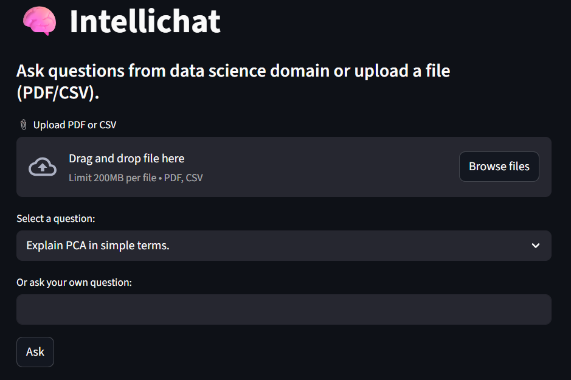

Here's the complete `README.md` file for your project **IntelliChat**:

---

````markdown
# 🤖 IntelliChat

IntelliChat is a smart, interactive chatbot application powered by **LangChain** and **OpenAI**. Built with **Streamlit**, it supports:
- Dynamic Q&A with conversational memory
- Chat history
- Drag-and-drop PDF and CSV file uploads
- Contextual answering from uploaded documents

---

## 📸 Demo Screenshot

  
> *Replace this with your own image named `demo.png` in the root folder.*

---

## 🚀 Features

✅ Ask questions on any topic  
✅ Upload PDFs or CSVs and query them  
✅ View full chat history  
✅ Uses OpenAI or Hugging Face LLMs via Langchain  
✅ Clean and simple Streamlit UI

---

## 🧱 Tech Stack

- **LangChain**
- **OpenAI / Hugging Face (LLMs)**
- **Streamlit**
- **PyPDF2** – For parsing PDFs  
- **pandas** – For handling CSVs  

---

## 🧑‍💻 Setup Instructions

### 1. Clone the Repo

```bash
git clone https://github.com/yourusername/IntelliChat.git
cd IntelliChat
````

### 2. Create Virtual Environment (optional but recommended)

```bash
python -m venv venv
# Activate
# Windows:
venv\Scripts\activate
# macOS/Linux:
source venv/bin/activate
```

### 3. Install Dependencies

```bash
pip install -r requirements.txt
```

> If `PyPDF2` or `streamlit` are missing, you can install them individually:

```bash
pip install PyPDF2 streamlit langchain openai python-dotenv pandas
```

---

## 🔑 Setup API Keys

Create a `.env` file in the root directory:

```bash
touch .env
```

Add your OpenAI API key:

```env
OPENAI_API_KEY=your-openai-api-key
```

> You can get your OpenAI API key from [https://platform.openai.com/account/api-keys](https://platform.openai.com/account/api-keys)

---

## 📁 File Upload Format

* PDF: Any readable text-based document
* CSV: Well-formatted table with headers

Once uploaded, IntelliChat can answer questions **based on the content** of the file.

---

## ▶️ Run the App

```bash
streamlit run app.py
```

Then open your browser and go to:
`http://localhost:8501`

---

## 📌 File Structure

```
IntelliChat/
│
├── app.py               # Main Streamlit app
├── requirements.txt     # Dependencies
├── .env                 # API Key file (you create this)
├── utils.py             # File processing helper functions
├── README.md            # This file
├── demo.png             # Optional screenshot for GitHub
```

---

## 📣 Future Ideas

* Add support for DOCX or XLSX files
* User login with session-based chat history
* Choice of LLMs (GPT-4, LLaMA 2, Mistral, etc.)
* Export full chat as PDF

---

## 📝 License

This project is licensed under the MIT License.

---

## 🙋‍♀️ Contact

Created by **Mansi Gupta**.
Feel free to raise issues or feature requests.

---

```

Let me know if you'd like:
- A sample `requirements.txt`
- GitHub repo structure auto-upload
- Deployment instructions (Streamlit Cloud, Hugging Face Spaces, etc.)
```
